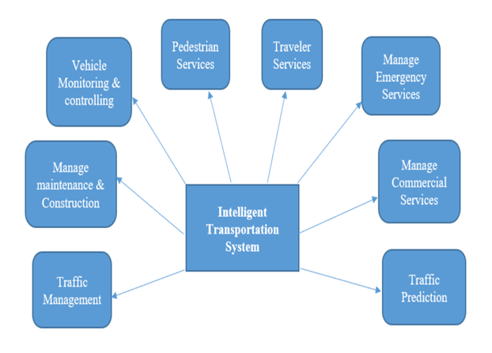

## 🚦 Smart Traffic Flow Prediction using LSTM

This project applies a deep learning model (LSTM – Long Short-Term Memory) to predict traffic flow between Minneapolis and St. Paul, Minnesota. It forecasts traffic volumes two hours ahead based on the previous six hours of data.

### Why It Matters

Traffic congestion causes delays, pollution, and economic loss. While traditional systems react to traffic, LSTM models help cities **predict and manage traffic proactively**, improving flow and safety.

###  What the Model Does

- Uses historical traffic data like vehicle count, speed, time, and weather  
- Learns traffic patterns over time  
- Predicts traffic volume 2 hours into the future

###  Why LSTM?

LSTM networks are ideal for time-based data. They remember long-term trends and patterns, making them highly effective for forecasting traffic flow.

###  Data Sources

- Cleaned traffic volume dataset  
- Time-based features: hour, day of the week, holidays  
- Weather data: rainfall, temperature, etc.  
- **Download the dataset here**: [Metro Interstate Traffic Volume – UCI Repository](https://archive.ics.uci.edu/ml/machine-learning-databases/00492/Metro_Interstate_Traffic_Volume.csv.gz)

###  Project Overview

  

<b>Figure: Intelligent Transportation System (ITS)</b>

---

### Questions, Feedback, or Collaboration?

If you have any questions, feedback, or would like to collaborate on improving this project, feel free to reach out or open an issue.  
Your thoughts are always welcome and appreciated! [Email: abeselomtesfay@gmail.com](mailto:abeselomtesfay@gmail.com)

